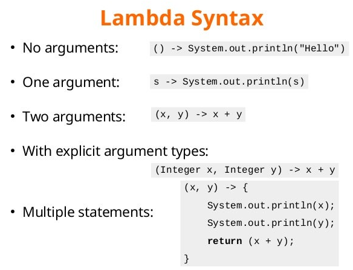

# Lambdas and Streams in Java

> This is a tutorials course covering lambdas and streams in Java.

Tools used:

- JDK 11
- Maven
- JUnit 5, Mockito
- IntelliJ IDE

## Table of contents

1. Introduction to Lambdas
    - Lambda Expressions and Functional Interfaces
    - Exploring `java.util.function` package
    - Lambdas vs Anonymous classes
    - Chaining and Composing Lambdas
2. Map Filter Reduce Algorithm
3. Building a Stream
4. Collecting data from Stream
5. Creating and Analysing Histograms from Streams

---

### Chapter 01. Introduction to Lambdas

#### Lambda Expressions and Functional Interfaces

Lambda expressions basically express instances of **functional interfaces**.

What is a **Functional interface**?

An interface with **single** abstract method is called functional interface.

- `default` and `static` methods in interface do **NOT** count.
- methods from `java.lang.Object` do **NOT** count (`equals()`, `toString()`, `hashCode()`, etc.)

An example is `java.lang.Runnable`.

```java
package java.lang;

@FunctionalInterface
public interface Runnable {
    void run();
}
```

Lambda expressions implement the only abstract function and therefore implement functional interfaces.

Lambda expressions are added in Java 8 and provide below functionalities:

- Enable to treat functionality as a **method argument**, or code as **data**.
- A function that can be created without belonging to any class.
- A lambda expression can be passed around as if it was an object and executed on demand.

**Example:**

Implement a functional interface.

```java

@FunctionalInterface
public interface Supplier<T> {
    T get();
}
```

```
Supplier<String> supplier = () -> "Hello Students!!";
```

Complete source code:

```java
import java.util.function.Supplier;

public class LambdaDemo {

    public static void main(final String[] args) {
        final Supplier<String> supplier = () -> "Hello Students!!";
        System.out.println(supplier.get());
    }

}
```

Output:

```
Hello Students!!
```

Another example using **Consumer**:

```java

@FunctionalInterface
public interface Consumer<T> {
    void accept(T t);

    default Consumer<T> andThen(final Consumer<? super T> after) {
        Objects.requireNonNull(after);
        return (T t) -> {
            accept(t);
            after.accept(t);
        };
    }
}
```

Complete source code:

```java
import java.util.Locale;
import java.util.function.Consumer;
import java.util.function.Supplier;

public class LambdaDemo {

    public static void main(final String[] args) {
        // Supplier
        final Supplier<String> supplier = () -> "Hello Students!!";
        System.out.println(supplier.get());

        // Consumer
        final Consumer<String> consumer = (String s) -> { // need to put in curly braces if more than 1 statements
            System.out.println(s.toUpperCase(Locale.ROOT));
            System.out.println(s.toLowerCase(Locale.ROOT));
        };
        consumer.accept(supplier.get());
    }

}
```

Output:

```
Hello Students!!
HELLO STUDENTS!!
hello students!!
```



#### Exploring `java.util.function` package

JDK has more than 40 interfaces in `java.util.function` package organized in 4 categories:

- Supplier
- Consumer
- Predicate
- Function

#### Supplier

The `Supplier`

- does not take any argument
- produces a value

```java
public interface Supplier<T> {
    T get();
}
```

```
Supplier<String> supplier = () -> "Hello";
```

#### Consumer

The `Consumer`

- takes any argument
- does not return anything

```java
public interface Consumer<T> {
    void accept(T t);
}
```

```
Consumer<String> consumer = s -> System.out.println(s);
```

#### Predicate

The `Predicate`

- takes any argument
- returns a **boolean**

Used to filter data.

```java
public interface Predicate<T> {
    boolean test(T t);
}
```

```
Predicate<String> isEmpty = s -> s.isEmpty();
```

#### Function

The `Function`

- takes any argument
- returns any type

Used to map data.

```java
public interface Function<T, R> {
    R apply(T t);
}
```

```
Function<Student, String> getStudentId = student -> student.getId();
```

#### Runnable

Although `Runnable` interface lies in `java.lang` package, it is still a functional interface. Thus, any interface which
has ONLY ONE abstract method is always a functional interface and annotating with `@FunctionalInterface` is optional.

The `Runnable`

- does not take any argument
- does not return anything

Used for defining thread task.

```java
public interface Runnable {
    void run();
}
```

```
Runnable runMe = () -> System.out.println("I am running in a separate thread");
```

#### Interview Problem 1 (Societe Generale): Demonstrate functional interfaces in code

Given a **Java POJO**:

```java
public class Student {

    private final String name;
    private final int age;

    public Student(final String name, final int age) {
        this.name = name;
        this.age = age;
    }

    public String getName() {
        return name;
    }

    public int getAge() {
        return age;
    }

    @Override
    public String toString() {
        return "Student{" +
                "name='" + name + '\'' +
                ", age=" + age +
                '}';
    }

}
```

1. Print all students using `Consumer`
2. Print all students names using `Function` and `Consumer`
3. Print all students names starting with **'T'** using `Predicate` and `Consumer`

**Solution**:

```java
import java.util.ArrayList;
import java.util.List;
import java.util.function.Function;
import java.util.function.Predicate;

public class FunctionalInterfacesDemo {

    public static void main(final String[] args) {
        final var john = new Student("John", 18);
        final var mary = new Student("Mary", 16);
        final var thomas = new Student("Thomas", 21);
        final var rahul = new Student("Rahul", 23);
        final var jenny = new Student("Jenny", 17);
        final var tatiana = new Student("Tatiana", 25);

        final var students = List.of(john, mary, thomas, rahul, jenny, tatiana);
        System.out.println("1. Print all students using Consumer~>");
        // Consumer
        students.forEach(student -> System.out.println(student));
        System.out.println("----------------------");

        final List<String> names = new ArrayList<>();

        // Function
        final Function<Student, String> toName = (Student student) -> student.getName();

        // Consumer
        students.forEach(student -> {
            final String name = toName.apply(student); // Function mapping
            names.add(name);
        });

        System.out.println("2. Print all students names using Function and Consumer~>");
        names.forEach(name -> System.out.println(name));
        System.out.println("----------------------");

        // Predicate
        final Predicate<String> startsWithT = name -> !name.startsWith("T");
        names.removeIf(startsWithT);
        // OR,
        // names.removeIf(name -> !name.startsWith("T")); // inline

        System.out.println("3. Print all students names starting with 'T' using Predicate and Consumer~>");
        // Consumer
        names.forEach(name -> System.out.println(name));
        System.out.println("----------------------");
    }

}
```

**Output**:

```
1. Print all students using Consumer~>
Student{name='John', age=18}
Student{name='Mary', age=16}
Student{name='Thomas', age=21}
Student{name='Rahul', age=23}
Student{name='Jenny', age=17}
Student{name='Tatiana', age=25}
----------------------
2. Print all students names using Function and Consumer~>
John
Mary
Thomas
Rahul
Jenny
Tatiana
----------------------
3. Print all students names starting with 'T' using Predicate and Consumer~>
Thomas
Tatiana
----------------------
```

#### Lambdas vs Anonymous classes

Prior to Java 8, the primary means of creating a **function object** was the **anonymous class**.

Code Snippet to sort a list of strings in order of length using an anonymous class to create the sort's comparison
function (which imposes the sort order):

```
        Collections.sort(words, new Comparator<String>() {
            @Override
            public int compare(final String s1, final String s2) {
                return Integer.compare(s1.length(), s2.length());
            }
        });
```

Lambdas are similar in function to anonymous class, but far more concise.

```
        Collections.sort(words, (s1, s2) -> Integer.compare(s1.length(), s2.length()));
        // OR
        Collections.sort(words, Comparator.comparingInt(String::length));
        // OR
        words.sort(Comparator.comparingInt(String::length));
```

The most important difference is in the **performance** => lambdas are more than **60 times faster** than anonymous
classes!

The reason is the way the Java compiler compiles the lambdas versus the anonymous classes.

Java compiler uses a special `invokedynamic` call to compile lambdas and thus the compiled code is different and much
faster.

Other reason is automatic **"boxing"** and **"unboxing"** of primitives and their wrapper classes.

For ex:

```
        Comparator<Integer> cmp = (i1, i2) -> Integer.compare(i1, i2);
        int compared = cmp.compare(5, 10);
```

Comparator interface:

```java
public interface Comparator<T> {
    int compare(T o1, T o2);
}
```

So above code will be interpreted as when we call compare method: `int compared = cmp.compare(5, 10);`

```java
public interface Comparator<Integer> {
    int compare(Integer o1, Integer o2);
}
```

Firstly, **boxing** will be done to promote primitive `int` 5 and 10 to `Integer`.

After the comparison, resulting `Integer` (a negative integer, zero, or a positive integer as the first argument is less
than, equal to, or greater than the second) will be converted back or **unboxed** to primitive `int`.

If this code is called on millions of integers => this will badly impact the performance.

Thus, to overcome this - a set of functional interfaces are added for primitive types which can be used by lambdas, for
ex:

- `IntPredicate`
- `LongSupplier`
- `IntFunction<T>`
- `LongToIntFunction`

Just taking an example again, in the `Supplier` interface, we have a generic type `T` returned via `get()` method.

```java
public interface Supplier<T> {
    T get();
}
```

However, for `LongSupplier` interface, we can directly get primitive `long` via `getAsLong()` method as return value
without any need to **box** it to wrapper `Long`.

```java
public interface LongSupplier {
    long getAsLong();
}
```

Similarly, for `DoubleToIntFunction` interface, we can directly work with primitives to create the function to
convert `double` to `int`.

```java
public interface DoubleToIntFunction {
    int applyAsInt(double value);
}
```

Complete Java code example to illustrate this:

```java
import java.util.function.DoubleToIntFunction;
import java.util.function.LongSupplier;

public class PrimitiveLambdas {

    public static void main(final String[] args) {
        final LongSupplier supplier = () -> 10L;
        final long i = supplier.getAsLong();
        System.out.printf("i = %d%n", i);

        final DoubleToIntFunction function = value -> (int) Math.ceil(value);
        final int pi = function.applyAsInt(Math.PI);
        System.out.printf("PI = %d%n", pi);
    }

}
```

**Output**:

```
i = 10
PI = 4
```

#### Chaining and Composing Lambdas

We can create new lambdas by combining existing lambdas:

- Predicate
- Consumer
- Function

We can also modify lambdas. All the above added functionalities are possible because of `default` or `static` methods
defined in the functional interfaces. And, there is still **only one** abstract method.

**Example source code**:

```java
import java.util.Locale;
import java.util.function.Consumer;
import java.util.function.Predicate;

public class ChainingLambdas {

    public static void main(final String[] args) {
        // Predicate
        final Predicate<String> isNull = s -> s == null;
        System.out.println("Using 'isNull' Predicate~>");
        System.out.printf("For null = %b%n", isNull.test(null));
        System.out.printf("For 'Hello Students' = %b%n", isNull.test("Hello Students"));
        System.out.println("------------------------");

        final Predicate<String> isEmpty = s -> s.isEmpty();
        System.out.println("Using 'isEmpty' Predicate~>");
        System.out.printf("For empty = %b%n", isEmpty.test(""));
        System.out.printf("For 'Hello Students' = %b%n", isEmpty.test("Hello Students"));
        System.out.println("------------------------");

        final Predicate<String> isNotNullOrEmpty = isNull.negate().and(isEmpty.negate()); // combine
        System.out.println("Using 'isNotNullOrEmpty' Predicate~>");
        System.out.printf("For null = %b%n", isNotNullOrEmpty.test(null));
        System.out.printf("For empty = %b%n", isNotNullOrEmpty.test(""));
        System.out.printf("For 'Hello Students' = %b%n", isNotNullOrEmpty.test("Hello Students"));
        System.out.println("------------------------");

        // Consumer
        final Consumer<String> c1 = s -> System.out.printf("c1 consumer prints as upper case: %s%n",
                                                           s.toUpperCase(Locale.ROOT));
        final Consumer<String> c2 = s -> System.out.printf("c2 consumer prints as lower case: %s%n",
                                                           s.toLowerCase(Locale.ROOT));

        final Consumer<String> c3 = c1.andThen(c2); // combine
        System.out.println("Using 'andThen' Consumer to combine~>");
        c3.accept("Hello Students");
        System.out.println("------------------------");
    }

}
```

**Output**:

```
Using 'isNull' Predicate~>
For null = true
For 'Hello Students' = false
------------------------
Using 'isEmpty' Predicate~>
For empty = true
For 'Hello Students' = false
------------------------
Using 'isNotNullOrEmpty' Predicate~>
For null = false
For empty = false
For 'Hello Students' = true
------------------------
Using 'andThen' Consumer to combine~>
c1 consumer prints as upper case: HELLO STUDENTS
c2 consumer prints as lower case: hello students
------------------------
```

#### Interview Problem 2 (Societe Generale - Follow up for Problem 1): Demonstrate combining lambdas

Given a POJO class:

```java
public class Student {

    private final String name;
    private final int age;

    public Student(final String name, final int age) {
        this.name = name;
        this.age = age;
    }

    public String getName() {
        return name;
    }

    public int getAge() {
        return age;
    }

    @Override
    public String toString() {
        return "Student{" +
                "name='" + name + '\'' +
                ", age=" + age +
                '}';
    }

}
```

- Sort student names as natural ordering and print
- Sort student names as its length and print
- Sort students by 'Name' and then 'Age' in descending order and print

**Solution**:

```java
import java.util.ArrayList;
import java.util.Arrays;
import java.util.Comparator;
import java.util.List;
import java.util.function.Function;
import java.util.function.ToIntFunction;

public class CombiningLambdas {

    public static void main(final String[] args) {
        final var john = new Student("John", 18);
        final var mary = new Student("Mary", 16);
        final var thomas = new Student("Thomas", 21);
        final var rahul = new Student("Rahul", 23);
        final var jenny = new Student("Jenny", 17);
        final var tatiana = new Student("Tatiana", 25);
        final var john1 = new Student("John", 19);

        final var students = Arrays.asList(john, mary, thomas, rahul, jenny, tatiana, john1);

        final List<String> studentNames = new ArrayList<>();
        final Function<Student, String> toName = (Student student) -> student.getName();
        students.forEach(student -> {
            final String name = toName.apply(student); // Function mapping
            studentNames.add(name);
        });

        final Comparator<String> cmp = (s1, s2) -> s1.compareTo(s2);
        studentNames.sort(cmp);
        System.out.printf("Sorted student names as natural ordering: %s%n", studentNames);

        final ToIntFunction<String> toLength = s -> s.length(); // no boxing or unboxing done
        final Comparator<String> cmp2 = Comparator.comparingInt(toLength); // combining Comparator and Function
        studentNames.sort(cmp2);
        System.out.printf("Sorted student names as its length: %s%n", studentNames);
        System.out.println("-------------------------");

        // Comparators chaining and combining
        final Comparator<Student> cmpName = Comparator.comparing(user -> user.getName());
        final Comparator<Student> cmpAge = Comparator.comparing(user -> user.getAge());
        final Comparator<Student> cmpNameAndThenAge = cmpName.thenComparing(cmpAge);
        final Comparator<Student> reversed = cmpNameAndThenAge.reversed();

        students.sort(reversed);
        System.out.println("Printing Students sorted by 'Name' and then 'Age' in descending order~>");
        students.forEach(student -> System.out.println(student));
        System.out.println("-------------------------");
    }

}
```

**Output**:

```
Sorted student names as natural ordering: [Jenny, John, John, Mary, Rahul, Tatiana, Thomas]
Sorted student names as its length: [John, John, Mary, Jenny, Rahul, Thomas, Tatiana]
-------------------------
Printing Students sorted by 'Name' and then 'Age' in descending order~>
Student{name='Thomas', age=21}
Student{name='Tatiana', age=25}
Student{name='Rahul', age=23}
Student{name='Mary', age=16}
Student{name='John', age=19}
Student{name='John', age=18}
Student{name='Jenny', age=17}
-------------------------
```

---

### Chapter 02. Map Filter Reduce Algorithm

The three methods, `map`, `filter`, and `reduce`, are the cornerstone of any functional programming.

Usually, our data pipelines consist of one or more intermediate operations, transforming (aka **mapping**) and/or
**filtering** elements, and a terminal operation to gather the data again (aka **reducing**).

For ex: Suppose we have a group of students in a class, and we want to know the average age of students who are older
than 18 years.

- `map()`

  List<Student> ==> Student object **mapped** to Integer age ==> List<Integer>

- `filter()`

  List<Integer> ==> Filter all ages who are older than 18 years, discard all the ages less than 18 ==> List<Integer>

- `reduce()`

  List<Integer> ==> reduce all the ages to **one single value**, which is **average** (other reduce operations are
  **sum**, **min**, **max**, etc.)

In SQL, same could be written as:

```roomsql
SELECT AVG(age) 
FROM Students 
WHERE age >= 18
```

In Java 8, with introduction of Streams API, same could be written as:

```
List<Student> students = ...

students.stream()
           .mapToInt(student -> student.getAge())
           .filter(age -> age >= 18)
           .average();
```

The most important point about using Stream API is that the data is **never duplicated**. In the above example,
`students.stream()` is just creating an **empty** `Stream<Student>` object.

Looking at the example again:

```
students.stream()                                  // Stream<Student>
           .mapToInt(student -> student.getAge())  // IntStream
           .filter(age -> age >= 18)               // IntStream 
           .average();                             // Reduce - triggers the computation
```

Thus, there are 2 kinds of methods in Stream API:

- methods that create a new Stream => called **intermediate** methods
- methods that produce a result => called **terminal** methods

Only terminal methods trigger the computation, otherwise the intermediate methods are **lazy** and will be computed only
after the terminal method is triggered.

Example code:

```java
public class Student {

    private final String name;
    private final int age;

    public Student(final String name, final int age) {
        this.name = name;
        this.age = age;
    }

    public String getName() {
        return name;
    }

    public int getAge() {
        return age;
    }

    @Override
    public String toString() {
        return "Student{" +
                "name='" + name + '\'' +
                ", age=" + age +
                '}';
    }

}
```

Example for `MapFilterReduceDemo`:

```java
import java.util.Arrays;

public class MapFilterReduceDemo {

    public static void main(final String[] args) {
        final var john = new Student("John", 18);
        final var mary = new Student("Mary", 16);
        final var thomas = new Student("Thomas", 21);
        final var rahul = new Student("Rahul", 23);
        final var jenny = new Student("Jenny", 17);
        final var tatiana = new Student("Tatiana", 25);

        final var students = Arrays.asList(john, mary, thomas, rahul, jenny, tatiana);

        final var countStudentsOlderThan20 = students.stream()
                                                     .mapToInt(student -> student.getAge())
                                                     .filter(age -> age >= 20)
                                                     .count();
        System.out.printf("Total no of students older than 20 years of age: %d%n", countStudentsOlderThan20);

        final var countStudentsLessThan20 = students.stream()
                                                    .mapToInt(student -> student.getAge())
                                                    .filter(age -> age < 20)
                                                    .count();
        System.out.printf("Total no of students less than 20 years of age: %d%n", countStudentsLessThan20);
    }

}
```

One more mapping function is available which is similar to `map()` but functionality is slightly different:

- `flatMap()`

  The `flatMap` method lets us replace each value of a stream with another stream and then concatenates all the
  generated streams into a single stream.

Example:

If `path` is the path to a file, then the following produces a stream of the words contained in that file:

     Stream<String> lines = Files.lines(path, StandardCharsets.UTF_8);
     Stream<String> words = lines.flatMap(line -> Stream.of(line.split(" +")));

The mapper function passed to `flatMap` splits a line, using a simple regular expression, into an array of words, and
then creates a stream of words from that array.

If we use `map()` instead of `flatMap()` above, it will return `Stream<Stream<String>>` instead of `Stream<String>`:

     Stream<Stream<String>> mappedLines = lines.map(line -> Stream.of(line.split(" +")));

Example code:

```java
import java.util.ArrayList;
import java.util.List;

public class Course {

    private final String courseName;
    private final List<Student> students = new ArrayList<>();

    public Course(final String courseName, final Student... students) {
        this.courseName = courseName;
        this.students.addAll(List.of(students));
    }

    public String getCourseName() {
        return courseName;
    }

    public List<Student> getStudents() {
        return List.copyOf(students);
    }

    @Override
    public String toString() {
        return "Course{" +
                "courseName='" + courseName + '\'' +
                ", students=" + students +
                '}';
    }
}
```

In this code snippet:

```
        // Flat Map
        final var advancedJava = new Course("Advanced Java", john, mary);
        final var python = new Course("Python", thomas, rahul);
        final var algorithms = new Course("Algorithms", jenny, tatiana);

        final var courses = List.of(advancedJava, python, algorithms);
        courses.stream()
               .flatMap(course -> course.getStudents().stream())
               .map(p -> p.getName())
               .forEach(name -> System.out.println(name));
```

If we use `map(course -> course.getStudents().stream())`, this will result in `Stream<Stream<Student>>` but we want
`Stream<Student>` instead => thus `flatMap()` is used.

Complete code:

```java
import java.util.Arrays;
import java.util.List;

public class MapFilterReduceDemo {

    public static void main(final String[] args) {
        final var john = new Student("John", 18);
        final var mary = new Student("Mary", 16);
        final var thomas = new Student("Thomas", 21);
        final var rahul = new Student("Rahul", 23);
        final var jenny = new Student("Jenny", 17);
        final var tatiana = new Student("Tatiana", 25);

        final var students = Arrays.asList(john, mary, thomas, rahul, jenny, tatiana);

        final var countStudentsOlderThan20 = students.stream()
                                                     .mapToInt(student -> student.getAge())
                                                     .filter(age -> age >= 20)
                                                     .count();
        System.out.printf("Total no of students older than 20 years of age: %d%n", countStudentsOlderThan20);

        final var countStudentsLessThan20 = students.stream()
                                                    .mapToInt(student -> student.getAge())
                                                    .filter(age -> age < 20)
                                                    .count();
        System.out.printf("Total no of students less than 20 years of age: %d%n", countStudentsLessThan20);

        // Flat Map
        final var advancedJava = new Course("Advanced Java", john, mary);
        final var python = new Course("Python", thomas, rahul);
        final var algorithms = new Course("Algorithms", jenny, tatiana);

        final var courses = List.of(advancedJava, python, algorithms);
        courses.stream()
               .flatMap(course -> course.getStudents().stream())
               .map(p -> p.getName())
               .forEach(name -> System.out.println(name));
    }

}
```

Output:

```
Total no of students older than 20 years of age: 3
Total no of students less than 20 years of age: 3
John
Mary
Thomas
Rahul
Jenny
Tatiana
```

#### Interview Problem 3 (Merrill Lynch): Flat Map problem

Given the below code snippet:

```
final var students = List.of("John", "Mary", "Peter");
final var favoriteLanguages = List.of("Java", "Python");
```

Task: return pair of both the lists =>

```
[("John", "Java"), ("John", "Python"), ("Mary", "Java"), ("Mary", "Python"), ("Peter", "Java"), ("Peter", "Python")]
```

**Solution**:

We could use two maps to iterate on the two lists and generate the pairs. But this would return a
`Stream<Stream<String[]>>`. What we need to do is `flatten` the generated streams to result in a `Stream<String[]>`.

Complete code solution:

```java
import java.util.List;
import java.util.stream.Collectors;

public class FlatMapInterviewProblem {

    public static void main(final String[] args) {
        final var students = List.of("John", "Mary", "Peter");
        final var favoriteLanguages = List.of("Java", "Python");

        final var pairs
                = students.stream()
                          .flatMap(student -> favoriteLanguages.stream()
                                                               .map(favoriteLanguage ->
                                                                            new String[]{student, favoriteLanguage}))
                          .collect(Collectors.toList());

        pairs.forEach(val -> System.out.printf("(%s,%s)%n", val[0], val[1]));
    }

}
```

Output:

```
(John,Java)
(John,Python)
(Mary,Java)
(Mary,Python)
(Peter,Java)
(Peter,Python)
```

---

### Chapter 03. Building a Stream
